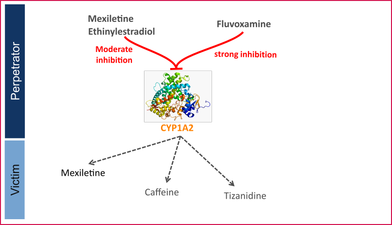

CYP1A2 is involved in the elimination of about 15% of all therapeutic drugs (e.g., clozapine, tacrine, tizanidine, and theophylline), a number of procarcinogens (e.g. benzo[*a*]pyrene and aflatoxin B1), and several important endogenous compounds (e.g. steroids and arachidonic acids) ([Zhou 2009](#5-references), [Goldstein 2001](#5-references)). This enzyme is exclusively expressed in the liver and can be markedly induced by smoking. Well-known substrates of CYP1A2 include caffeine and tizanidine.

Like other CYPs, CYP1A2 is subject to induction and/or inhibition by a number of compounds, which can result in significant drug interactions in clinical practice. 

The U.S. Food and Drug Administration (FDA) lists several perpetrator and victim drugs of interactions in the CYP1A2 network ([FDA](#5-references)). For instance, caffeine and tizanidine are classified as sensitive index substrates for CYP1A2, and fluvoxamine is listed as a strong clinical index inhibitor of CYP1A2.

To qualify the developed models for the prediction of the CYP1A2 DDI potential of new drugs, a set of verified PBPK models of index perpetrators and respective CYP1A2 DDI victim drugs is specified to set up a CYP1A2-mediated DDI modeling network.

The following perpetrator compounds were selected: 

- **Fluvoxamine** (strong CYP1A2 inhibitor)
  Model snapshot and evaluation plan (*release* **alt_v1.0**): https://github.com/Open-Systems-Pharmacology/Fluvoxamine-Model/releases/tag/alt_v1.0
- **Ethinylestradiol** (moderate CYP1A2 inhibitor)
  Model snapshot and evaluation plan (*release* **v1.1**): https://github.com/Open-Systems-Pharmacology/Ethinylestradiol-Model/releases/tag/v1.1
- **Mexiletine** (moderate CYP1A2 inhibitor)
  Model snapshot and evaluation plan (*release* **v1.1**): https://github.com/Open-Systems-Pharmacology/Mexiletine-Model/releases/tag/v1.1

The following sensitive CYP1A2 substrates as victim drugs were selected:

- **Caffeine**
  PK-Sim compound template
- **Tizanidine**
  Model snapshot and evaluation plan (*release* **v1.1**): https://github.com/Open-Systems-Pharmacology/Tizanidine-Model/releases/tag/v1.1
- **Mexiletine**
  Model snapshot and evaluation plan (*release* **v1.1**): https://github.com/Open-Systems-Pharmacology/Mexiletine-Model/releases/tag/v1.1

The following interaction studies were predicted and used to qualify/optimize the final network:

- Strong CYP1A2 inhibition

  - Fluvoxamine - caffeine
  - Fluvoxamine - tizanidine
  - Fluvoxamine - mexiletine
- Moderate CYP1A2 inhibition
  - Mexiletine - caffeine
  - Mexiletine - tizanidine
  - Ethinylestradiol - caffeine
  - Ethinylestradiol - tizanidine

**Figure 1** shows the specified and developed DDI modeling network of interacting perpetrator and victim drugs.

**Figure** **1: CYP1A2 DDI modeling network**

The Ki values used to predict the interactions are listed in [Table 1](#table-1).

| **Inhibitor category** | **Inhibitor**         | **Substrate** | **Ki**    | **Reference**             |
| ---------------------- | --------------------- | ------------- | --------- | ------------------------- |
| Strong CYP1A2          | Fluvoxamine           | caffeine      | 2.97 nM   | [Iga 2016](#5-references) |
|                        |                       | tizanidine    | 0.8697 nM | Fit1           |
|                        |                       | mexiletine    | 2.97 nM   | [Iga 2016](#5-references) |
| Moderate CYP1A2        | Mexiletine            | caffeine      | 0.28 µM   | [Wei 1999](#5-references) |
|                        |                       | tizanidine    | 0.28 µM   | [Wei 1999](#5-references) |
|                        | Ethinylestradiol (EE) | caffeine      | 0.48 µM   | Fit2           |
|                        |                       | tizanidine    | 0.48 µM   | Fit2           |

**Table 1:** Ki values used in CYP1A2 DDI network. 1Lowest literature value = 0.9 nM; 2Literature value = 10.6 µM

The published DDI studies between the respective perpetrators and victim drugs were simulated and compared to observed data. The following sections give an overview of the clinical studies being part of this qualification report.