# CYP1A2 DDI Qualification

| Version                         | x.x-OSPy.y                                                   |
| ------------------------------- | ------------------------------------------------------------ |
| Qualification Plan Release      | https://github.com/Open-Systems-Pharmacology/Qualification-DDI-CYP1A2/releases/tag/vx.x |
| OSP Version                     | y.y                                                          |
| Qualification Framework Version | z.z                                                          |

This qualification report is filed at:

https://github.com/Open-Systems-Pharmacology/OSP-Qualification-Reports
# Table of Contents
  * [1 Introduction](#1-introduction)
    * [Perpetrator](#perpetrator)
      * [Fluvoxamine](#fluvoxamine)
    * [Victim](#victim)
      * [Caffeine](#caffeine)
# 1 Introduction
                   

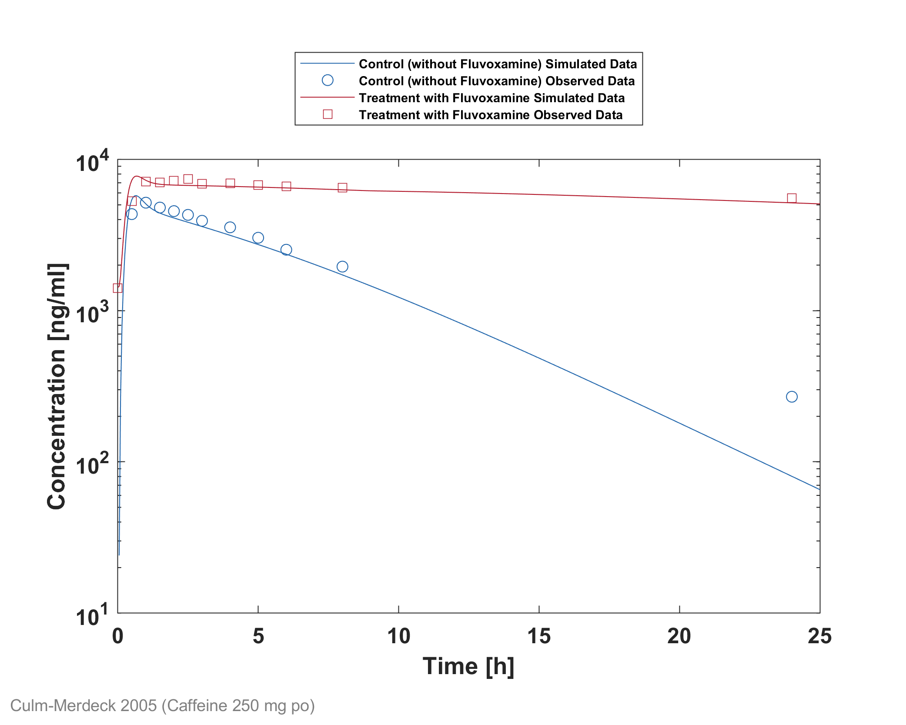

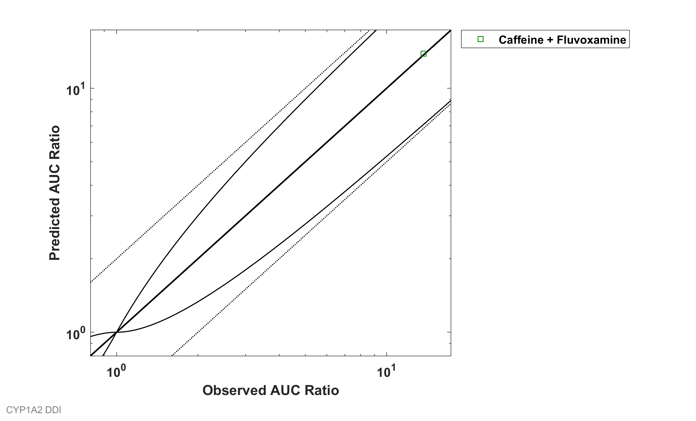

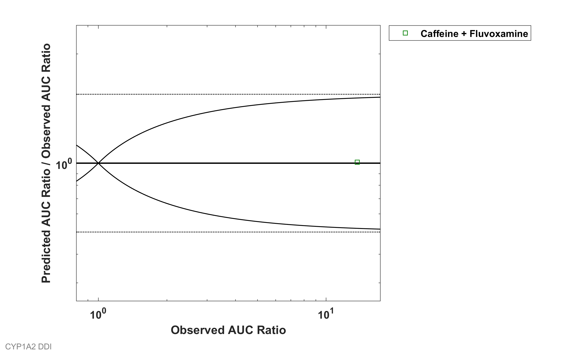

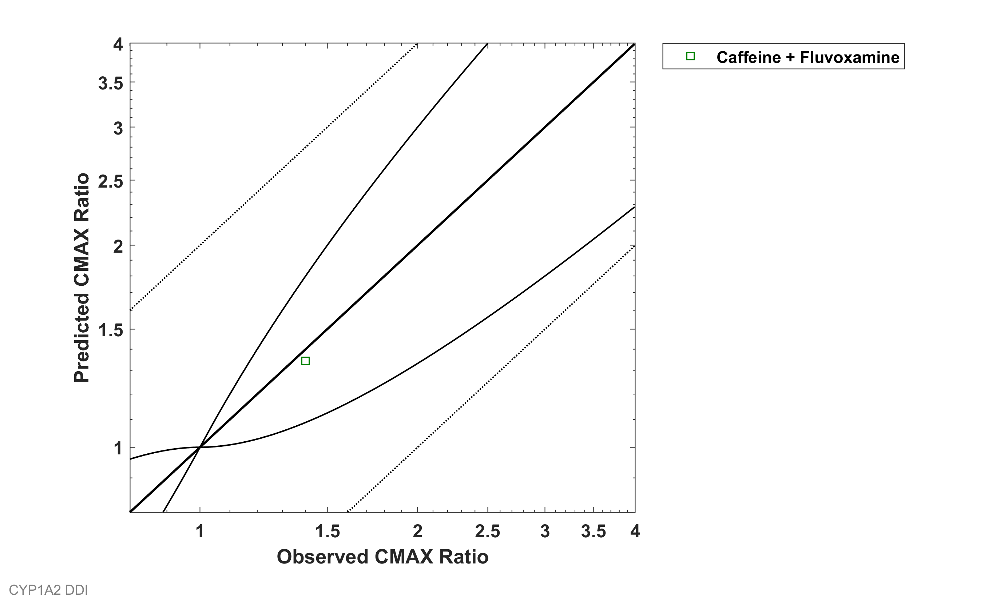

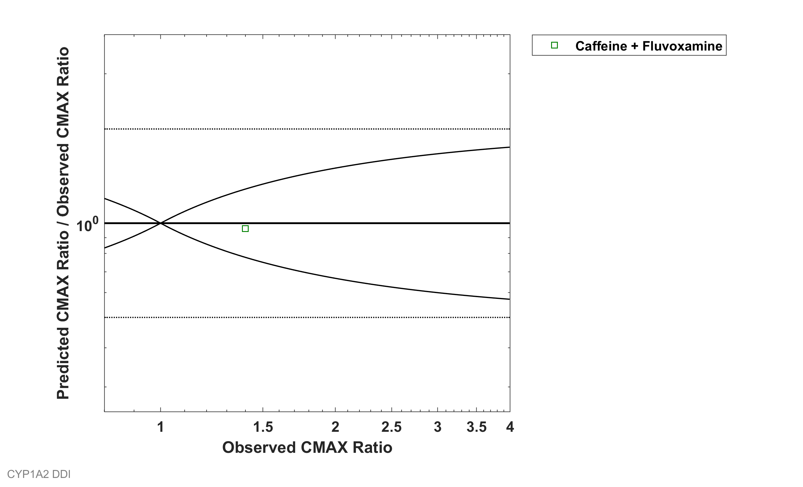

GMFE (AUC) = 1.010147 

GMFE (CMAX) = 1.040966 

|AUC                       |Number|Ratio [%]|
|-------------------------:|-----:|--------:|
|Points total              |1     |-        |
|Points within Guest et al.|1     |100      |
|Points within 2-fold      |1     |100      |

|CMAX                      |Number|Ratio [%]|
|-------------------------:|-----:|--------:|
|Points total              |1     |-        |
|Points within Guest et al.|1     |100      |
|Points within 2-fold      |1     |100      |

|DataID|Perpetrator              |Victim      |Predicted AUC Ratio|Observed AUC Ratio|Pred/Obs AUC Ratio|Predicted CMAX Ratio|Observed CMAX Ratio|Pred/Obs CMAX Ratio|Reference       |
|-----:|------------------------:|-----------:|------------------:|-----------------:|-----------------:|-------------------:|------------------:|------------------:|---------------:|
|14006 |Fluvoxamine, 100 mg, PO, |Caffeine, PO|13.8491            |13.71             |1.0101            |1.3449              |1.4                |0.96065            |Culm-Merdek 2005|

## Perpetrator

### Fluvoxamine

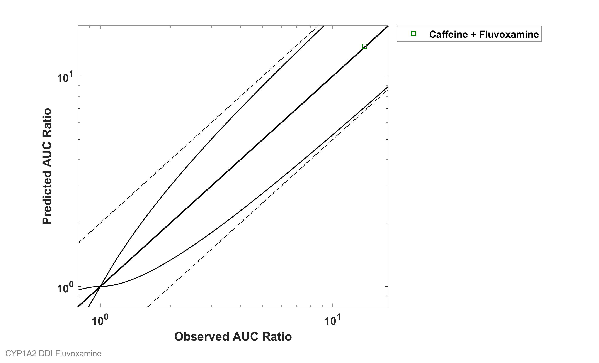

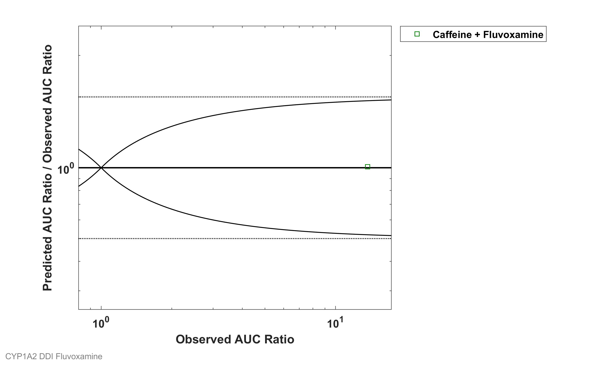

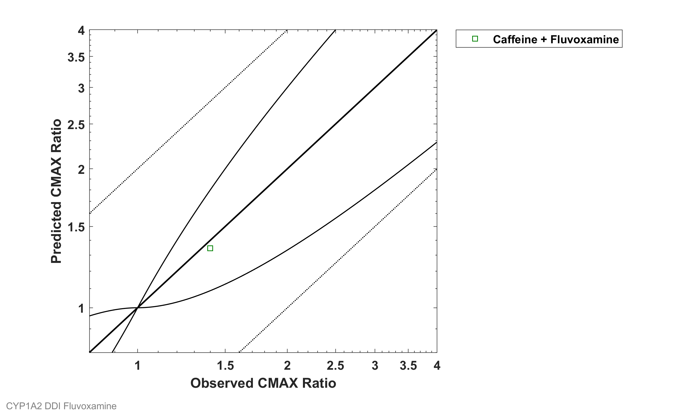

GMFE (AUC) = 1.010147 

GMFE (CMAX) = 1.040966 

|AUC                       |Number|Ratio [%]|
|-------------------------:|-----:|--------:|
|Points total              |1     |-        |
|Points within Guest et al.|1     |100      |
|Points within 2-fold      |1     |100      |

|CMAX                      |Number|Ratio [%]|
|-------------------------:|-----:|--------:|
|Points total              |1     |-        |
|Points within Guest et al.|1     |100      |
|Points within 2-fold      |1     |100      |

## Victim

### Caffeine

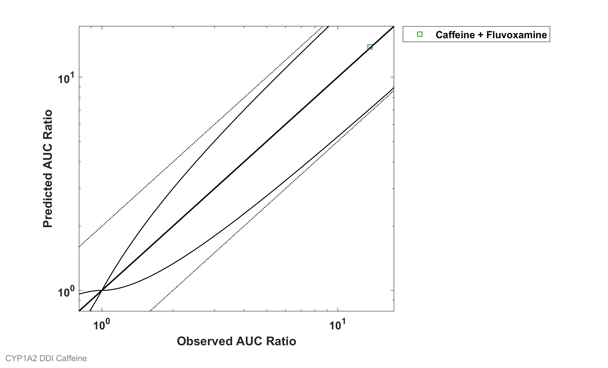

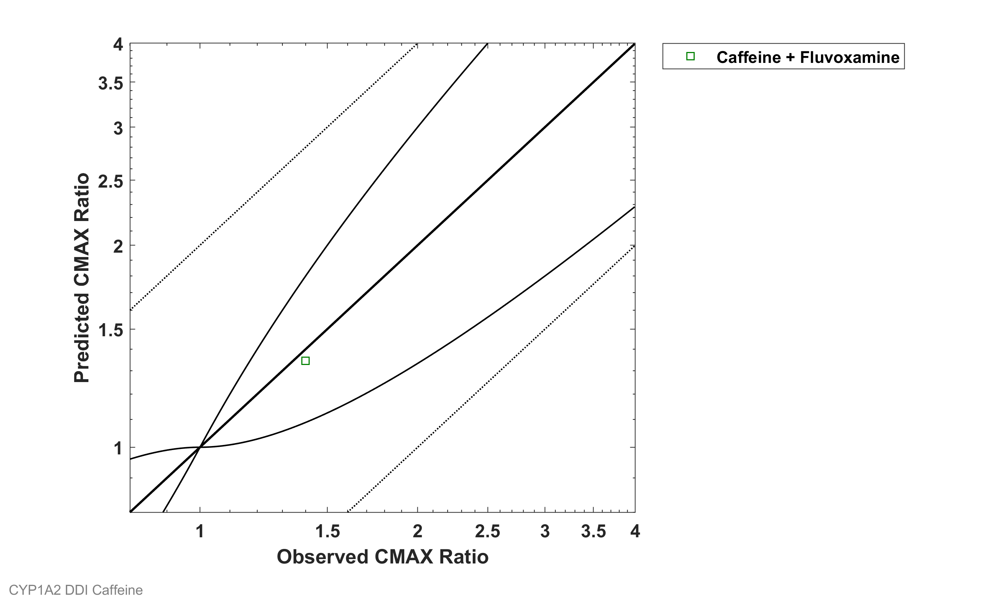

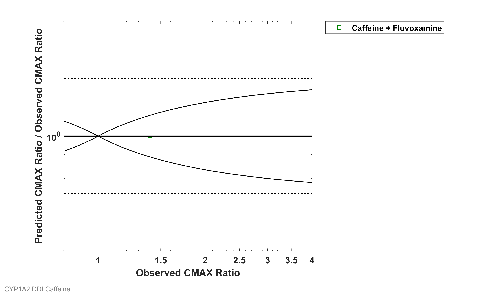

GMFE (AUC) = 1.010147 

GMFE (CMAX) = 1.040966 

|AUC                       |Number|Ratio [%]|
|-------------------------:|-----:|--------:|
|Points total              |1     |-        |
|Points within Guest et al.|1     |100      |
|Points within 2-fold      |1     |100      |

|CMAX                      |Number|Ratio [%]|
|-------------------------:|-----:|--------:|
|Points total              |1     |-        |
|Points within Guest et al.|1     |100      |
|Points within 2-fold      |1     |100      |

