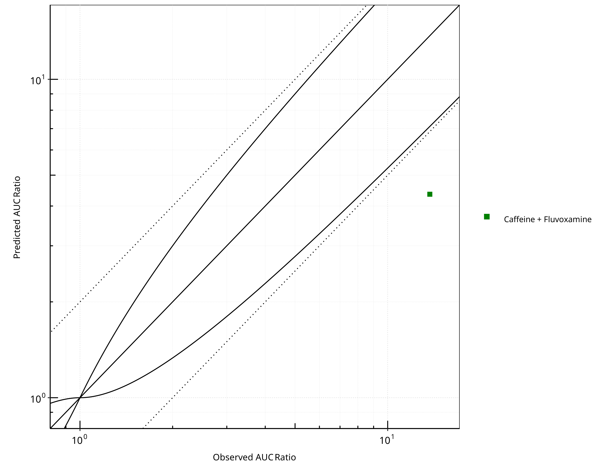
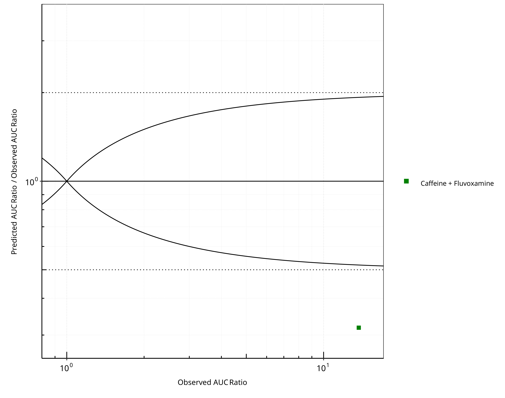
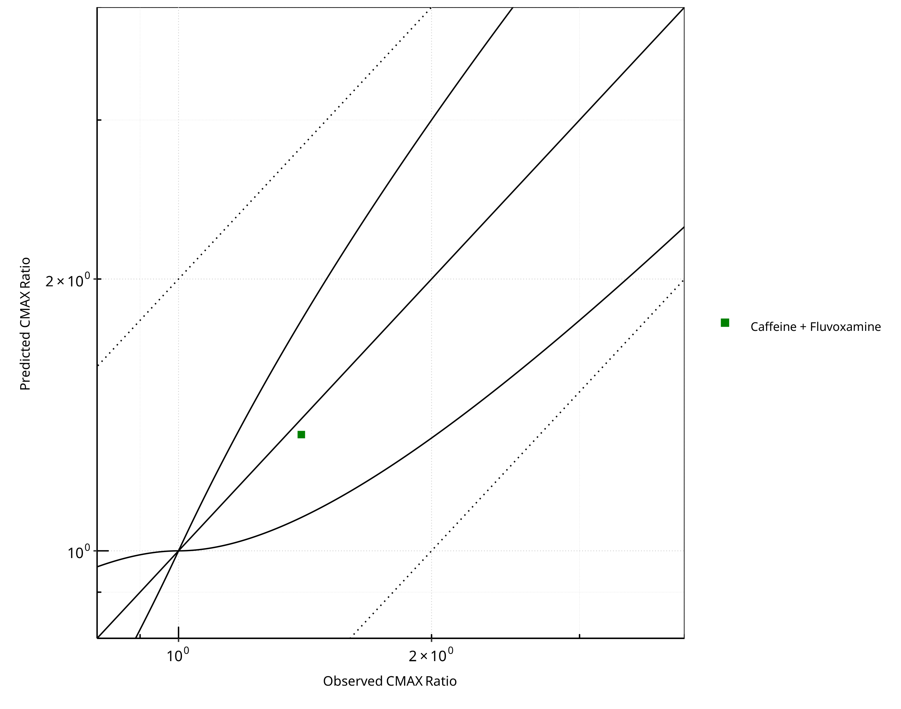
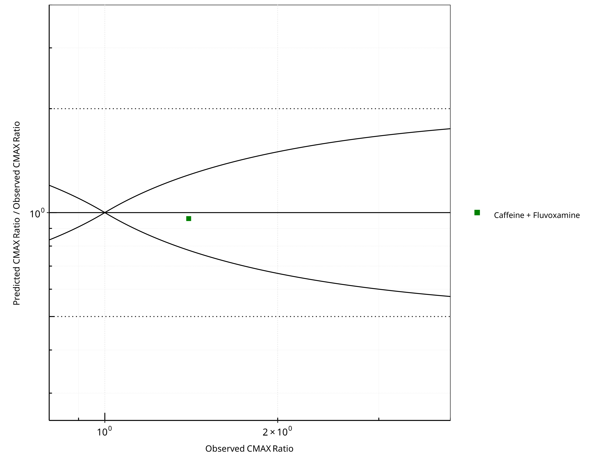
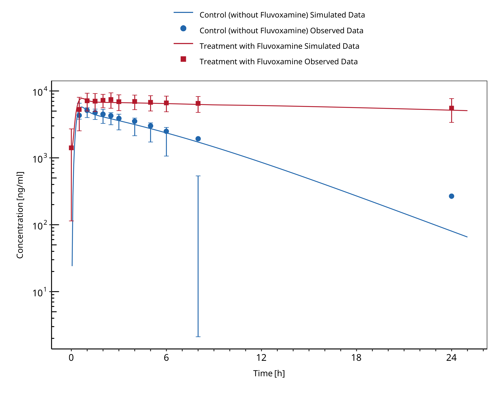

# 1 Introduction`<w:bookmarkStart w:id="1" w:name="1"/><w:bookmarkEnd w:id="1"/>`{=openxml}


                   


```{=openxml}
<w:br w:type="page"/>
```

`<w:bookmarkStart w:id="figure-1-1" w:name="figure-1-1"/><w:bookmarkEnd w:id="figure-1-1"/>`{=openxml}




**Figure 1-1: CYP1A2 DDI.  Predicted vs. Observed AUC Ratio. (&delta; = 1 in Guest *et al.* formula)**


<br>
<br>


```{=openxml}
<w:br w:type="page"/>
```

`<w:bookmarkStart w:id="figure-1-2" w:name="figure-1-2"/><w:bookmarkEnd w:id="figure-1-2"/>`{=openxml}




**Figure 1-2: CYP1A2 DDI.  Predicted/Observed vs. Observed AUC Ratio. (&delta; = 1 in Guest *et al.* formula)**


<br>
<br>


```{=openxml}
<w:br w:type="page"/>
```

`<w:bookmarkStart w:id="figure-1-3" w:name="figure-1-3"/><w:bookmarkEnd w:id="figure-1-3"/>`{=openxml}




**Figure 1-3: CYP1A2 DDI.  Predicted vs. Observed CMAX Ratio. (&delta; = 1 in Guest *et al.* formula)**


<br>
<br>


```{=openxml}
<w:br w:type="page"/>
```

`<w:bookmarkStart w:id="figure-1-4" w:name="figure-1-4"/><w:bookmarkEnd w:id="figure-1-4"/>`{=openxml}




**Figure 1-4: CYP1A2 DDI.  Predicted/Observed vs. Observed CMAX Ratio. (&delta; = 1 in Guest *et al.* formula)**


<br>
<br>


```{=openxml}
<w:br w:type="page"/>
```

`<w:bookmarkStart w:id="table-1-1" w:name="table-1-1"/><w:bookmarkEnd w:id="table-1-1"/>`{=openxml}

**Table 1-1: GMFE for CYP1A2 DDI Ratio**


|PK parameter |GMFE |
|:------------|:----|
|AUC          |3.15 |
|CMAX         |1.04 |


<br>
<br>


```{=openxml}
<w:br w:type="page"/>
```

`<w:bookmarkStart w:id="table-1-2" w:name="table-1-2"/><w:bookmarkEnd w:id="table-1-2"/>`{=openxml}

**Table 1-2: Summary table for CYP1A2 DDI - AUC Ratio. (&delta; = 1 in Guest *et al.* formula)**


|AUC                          |Number |Ratio [%] |
|:----------------------------|:------|:---------|
|Points total                 |1      |-        |
|Points within Guest *et al.* |0      |0         |
|Points within 2 fold         |0      |0         |


<br>
<br>


```{=openxml}
<w:br w:type="page"/>
```

`<w:bookmarkStart w:id="table-1-3" w:name="table-1-3"/><w:bookmarkEnd w:id="table-1-3"/>`{=openxml}

**Table 1-3: Summary table for CYP1A2 DDI - CMAX Ratio. (&delta; = 1 in Guest *et al.* formula)**


|CMAX                         |Number |Ratio [%] |
|:----------------------------|:------|:---------|
|Points total                 |1      |-        |
|Points within Guest *et al.* |1      |100       |
|Points within 2 fold         |1      |100       |


<br>
<br>


```{=openxml}
<w:br w:type="page"/>
```

`<w:bookmarkStart w:id="table-1-4" w:name="table-1-4"/><w:bookmarkEnd w:id="table-1-4"/>`{=openxml}

**Table 1-4: Summary table for CYP1A2 DDI**


|DataID |Perpetrator              |Victim       |Predicted AUC Ratio |Observed AUC Ratio |Pred/Obs AUC Ratio |Predicted CMAX Ratio |Observed CMAX Ratio |Pred/Obs CMAX Ratio |Reference        |
|:------|:------------------------|:------------|:-------------------|:------------------|:------------------|:--------------------|:-------------------|:-------------------|:----------------|
|14006  |Fluvoxamine, 100 mg, PO, |Caffeine, PO |4.35                |13.71              |0.32               |1.34                 |1.40                |0.96                |Culm-Merdek 2005 |


<br>
<br>


```{=openxml}
<w:br w:type="page"/>
```

`<w:bookmarkStart w:id="figure-1-5" w:name="figure-1-5"/><w:bookmarkEnd w:id="figure-1-5"/>`{=openxml}




**Figure 1-5: Culm-Merdeck 2005 (Caffeine 250 mg po)**


<br>
<br>


